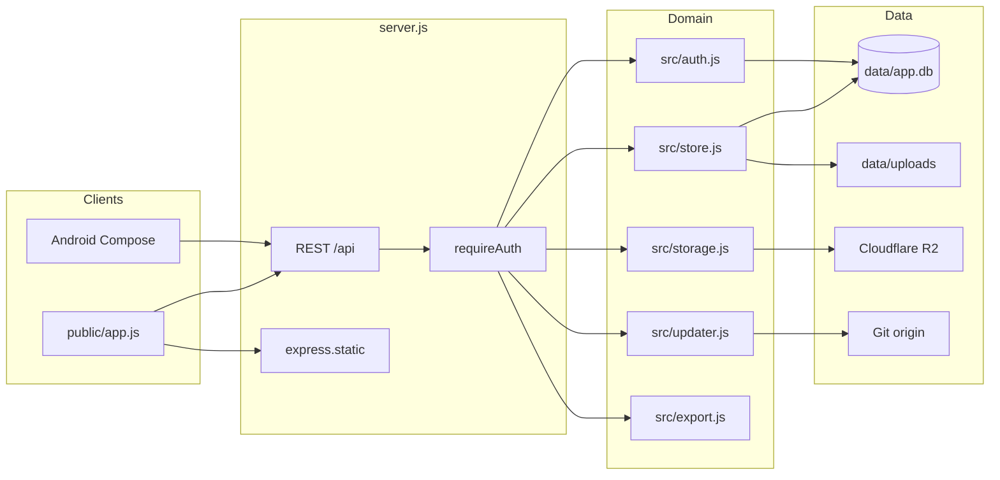
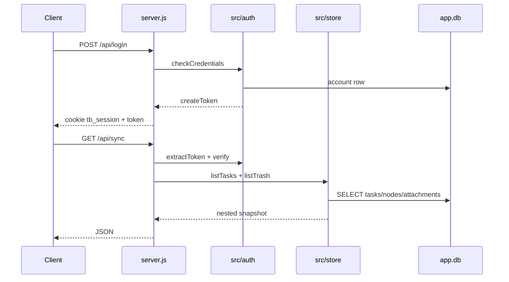
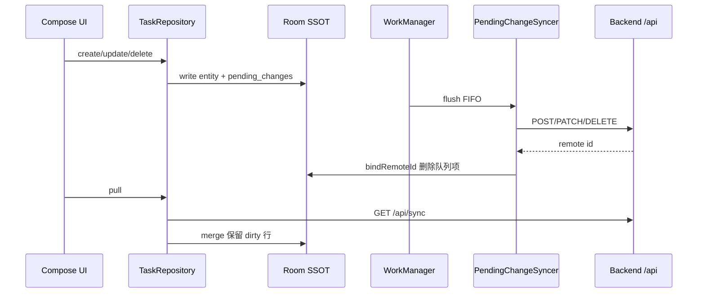

# 架构设计

## 概述

task-panel（npm 包名 `task-board`，版本 1.0.1）是一套自托管的个人任务管理面板。用户以单账号登录后，用卡片看板管理并行任务；每个任务包含若干节点，节点可附带正文、完成状态与附件。系统把任务树、回收站、账号与设置持久化到本机 SQLite，附件可落在本地磁盘或 Cloudflare R2。

目标用户是需要自己部署、自己保管数据的个人或小团队。Web 端（`public/`）是主界面，覆盖看板、节点抽屉、任务详情、回收站、设置、一键更新与全量导出。Android 客户端（`android/`，包名 `com.taskboard.sync`，versionName 1.0.2）连接同一套 `/api`：任务与节点支持离线编辑，附件上传、回收站与导出走在线接口。

效果上，一次部署即可同时服务浏览器与手机：浏览器走 httpOnly Cookie，移动端走同一枚 HMAC 签名令牌（`Authorization: Bearer`）。删除走软删除 + `delete_batch` 分组，默认保留 30 天后由小时级定时器彻底清除。导出产出一份 ZIP（`data.json`、`manifest.json`、每任务 Markdown、本地附件文件）。

## 技术栈

**语言与运行时**
- Node.js >= 22.5.0（使用 `node:sqlite` 的 `DatabaseSync`、`process.loadEnvFile`）
- Kotlin（Android，JVM 17）
- 原生 HTML / CSS / JavaScript（Web 前端无打包器）

**框架**
- Express 4.21.2
- cookie-parser、multer
- Android：Jetpack Compose + Material 3 + Navigation Compose、Room、Retrofit、OkHttp、WorkManager、KSP

**数据存储**
- SQLite（`data/app.db`，WAL + foreign_keys）
- 本地附件目录 `data/uploads/`
- Cloudflare R2（S3 兼容，`@aws-sdk/client-s3`）
- Android Room 本地库（任务/节点/附件/pending_changes/sync_meta）

**测试**
- 后端：`node --test`（`test/auth.test.js`、`test/export.test.js`、`test/updater.test.js`）
- Android：JUnit（`android/app/src/test/`）

**外部服务**
- Cloudflare R2 对象存储（可选）
- Git 远程仓库（一键更新：`git fetch` / `reset` + `npm install` + 进程重启）

## 项目结构

```
task-panel/
├── server.js                 # Express 入口：路由、鉴权、上传、静态资源
├── package.json              # 依赖与脚本（start / dev / test）
├── .env.example              # 环境变量模板
├── src/
│   ├── env.js                # 加载 .env
│   ├── db.js                 # SQLite 建表与列迁移
│   ├── store.js              # 任务/节点/附件/回收站领域操作
│   ├── auth.js               # 单账号、scrypt 哈希、HMAC 会话令牌
│   ├── settings.js           # settings 表 KV
│   ├── storage.js            # R2 配置解析与对象读写
│   ├── export.js             # ZIP 导出
│   └── updater.js            # Git 一键更新与进程交接
├── public/
│   ├── index.html            # 单页 UI
│   ├── app.js                # 前端状态与 API 调用
│   └── styles.css
├── test/                     # Node 测试
├── android/                  # Kotlin 原生客户端
│   └── app/src/main/java/com/taskboard/sync/
│       ├── data/remote/      # Retrofit、DTO、Bearer 拦截器
│       ├── data/local/       # Room
│       ├── data/repository/  # 仓储
│       ├── data/sync/        # 离线队列与 WorkManager
│       ├── di/               # AppContainer
│       └── ui/               # Compose 页面
└── data/                     # 运行时数据（gitignore）：app.db、uploads/
```

**入口点**
- `server.js` - HTTP 服务启动、全部 `/api` 路由、静态资源与 SPA fallback
- `public/app.js` - Web 客户端
- `android/app/src/main/java/com/taskboard/sync/TaskBoardApp.kt` - Android Application
- `android/app/src/main/java/com/taskboard/sync/MainActivity.kt` - Compose 入口

## 子系统

### HTTP API 层
**目的**: 暴露 REST JSON API，处理鉴权、上传限制、错误映射与静态托管。
**位置**: `server.js`
**关键文件**: `server.js`
**依赖**: `src/store`、`src/auth`、`src/storage`、`src/updater`、`src/export`、`src/db`
**被依赖**: `public/app.js`、Android `TaskBoardApi`

### 领域存储
**目的**: 任务树 CRUD、软删除批次、回收站恢复/清空、导出快照。
**位置**: `src/store.js`
**关键文件**: `src/store.js`、`src/db.js`
**依赖**: `node:sqlite`、`src/storage`（R2 公开 URL）
**被依赖**: `server.js`

### 鉴权
**目的**: 单账号种子、密码校验、HMAC-SHA256 会话令牌、改密后令牌版本失效。
**位置**: `src/auth.js`
**关键文件**: `src/auth.js`
**依赖**: `src/db`、`SESSION_SECRET`
**被依赖**: `server.js`、`test/auth.test.js`

### 对象存储
**目的**: 解析 R2 配置（settings 表优先于环境变量），上传/下载/删除对象，生成公开 URL。
**位置**: `src/storage.js`
**关键文件**: `src/storage.js`、`src/settings.js`
**依赖**: `@aws-sdk/client-s3`、`src/settings`
**被依赖**: `server.js`、`src/store`

### 一键更新
**目的**: 配置 Git remote/branch，拉取代码、安装依赖、关闭 HTTP 后 execve/pm2/systemd 重启。
**位置**: `src/updater.js`
**关键文件**: `src/updater.js`
**依赖**: `src/db`（DATA_DIR 日志与锁）、`src/settings`、本机 `git`/`npm`
**被依赖**: `server.js`

### 导出
**目的**: 把任务快照打成 ZIP：结构化 JSON、清单、Markdown、本地附件。
**位置**: `src/export.js`
**关键文件**: `src/export.js`
**依赖**: `archiver`、`src/db`（UPLOAD_DIR）
**被依赖**: `server.js`、`test/export.test.js`

### Web 前端
**目的**: 登录、看板、节点编辑、附件预览、回收站、设置（账号/R2/远程/更新/导出）。
**位置**: `public/`
**关键文件**: `public/app.js`、`public/index.html`、`public/styles.css`
**依赖**: `/api`（`credentials: 'same-origin'`）
**被依赖**: Express `express.static`

### Android 同步客户端
**目的**: 以 Room 为 SSOT 做任务/节点离线编辑，WorkManager FIFO 提交 pending_changes；附件、回收站、导出在线。
**位置**: `android/`
**关键文件**: `TaskBoardApi.kt`、`PendingChangeSyncer.kt`、`AppContainer.kt`、`AppNav.kt`
**依赖**: 后端 `/api`
**被依赖**: 无（独立 APK）

## 图表






