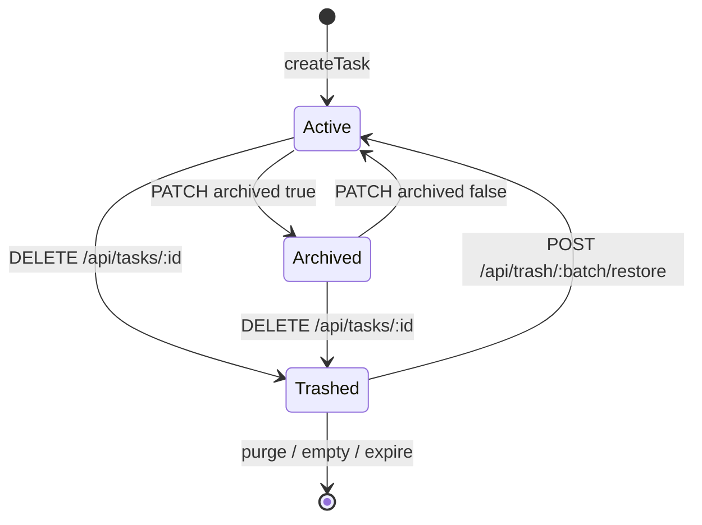
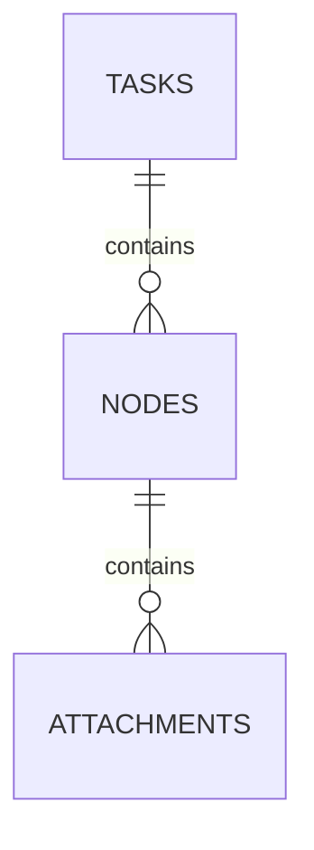

# 任务

看板上一张卡片，代表一条可并行推进的工作项。任务下挂节点，节点下挂附件。

## 什么是任务？

任务是领域根实体。Web 看板按任务分列。归档任务默认隐藏，可通过「显示归档」打开。

**关键特征**:
- 有标题、描述、颜色、归档标记、排序值
- 软删除时连同未删节点与附件写入同一 `delete_batch`
- `sort_order` 为 REAL，拖拽重排时按数组下标重写

## 代码位置

| 方面 | 位置 |
|------|------|
| 表 | `tasks`（`src/db.js`） |
| 领域 | `src/store.js`（`listTasks` / `createTask` / `updateTask` / `trashTask` / `reorderTasks`） |
| API | `GET/POST /api/tasks`、`PATCH/DELETE /api/tasks/:id`、`POST /api/tasks/reorder` |
| Web | `public/app.js` 看板与任务弹窗 |

## 结构

```javascript
{
  id: 1,
  title: "发布 1.0",
  description: "",
  color: "blue",
  archived: false,
  sort_order: 1,
  created_at: "ISO-8601",
  updated_at: "ISO-8601",
  nodes: [ /* Node */ ]
}
```

列表接口嵌套 `nodes`；`POST`/`PATCH` 返回的单行任务来自 `getTask`，不含 nodes。

### 关键字段

| 字段 | 类型 | 描述 | 约束 |
|------|------|------|------|
| `id` | INTEGER | 主键 | AUTOINCREMENT |
| `title` | TEXT | 名称 | 创建时非空 trim |
| `description` | TEXT | 说明 | 默认 `''` |
| `color` | TEXT | 卡片强调色 | 默认 `blue` |
| `archived` | INTEGER | 归档 | 0/1，接口布尔 |
| `sort_order` | REAL | 顺序 | 新建取 `MAX+1` |
| `deleted_at` | TEXT | 软删时间 | NULL 表示在看板 |
| `delete_batch` | TEXT | 回收站批次 | UUID |

## 不变量

1. **列表可见性**: `listTasks` 只返回 `deleted_at IS NULL`。
2. **归档排序**: 未归档排在归档之前。
3. **级联软删**: `trashTask` 把该任务下所有未删节点及附件打上同一 batch。

## 生命周期



### 状态描述

| 状态 | 描述 | 允许的转换 |
|------|------|-----------|
| 进行中 | `archived=0` 且未删除 | 归档、软删、编辑 |
| 已归档 | `archived=1` | 取消归档、软删 |
| 回收站 | `deleted_at` 有值 | 恢复或彻底删除 |

## 关系



| 关联概念 | 关系 | 描述 |
|---------|------|------|
| 节点 | 一对多 | `nodes.task_id` 外键，ON DELETE CASCADE（硬删时） |
| 回收站批次 | 软删分组 | 与节点、附件共享 `delete_batch` |
