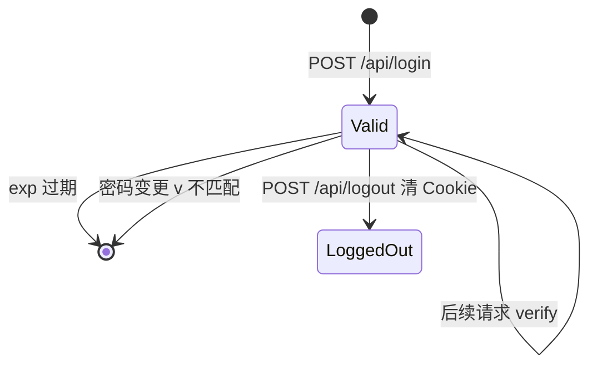

# 会话令牌

HMAC-SHA256 签名的会话凭证，Web Cookie 与 Bearer 请求头共用同一套 `createToken` / `verify`。

## 什么是会话令牌？

格式：`base64url(JSON payload) + "." + HMAC-SHA256(data, SESSION_SECRET)`。

payload：`{ exp: Date.now() + 30d, v: sessionVersion() }`。`v` 是账号 `password_hash` 的 SHA-256 截断 16 位。改密后旧令牌校验失败。

系统始终 `auth.isEnabled() === true`（单账号，不开放注册）。库空时用 `APP_USERNAME` / `APP_PASSWORD` 插入 `account` 唯一行（`id` CHECK = 1）。

**关键特征**:
- Cookie 名 `tb_session`，httpOnly、sameSite=lax
- `extractToken`：Cookie 优先于 `Authorization: Bearer`
- 未配置 `SESSION_SECRET` 时进程内随机，重启后全部登录失效

## 代码位置

| 方面 | 位置 |
|------|------|
| 实现 | `src/auth.js` |
| HTTP | `server.js` `setSessionCookie` / `requireAuth` |
| 测试 | `test/auth.test.js` |

## 结构

无独立数据表存会话。账号表：

```sql
account (
  id INTEGER PRIMARY KEY CHECK (id = 1),
  username TEXT,
  password_hash TEXT,
  salt TEXT,
  updated_at TEXT
)
```

密码：`scryptSync(password, salt, 64)` hex。

## 不变量

1. 用户名比较与 HMAC 比较使用 `timingSafeEqual`。
2. 登录失败按 `req.ip` 计数，满 5 次设置 `until = now + 5min`。
3. `PUT /api/account` 成功后立刻 `createToken` 并 Set-Cookie，供 Bearer 客户端替换本地令牌。
4. `POST /api/logout` 只清 Cookie，服务端无令牌黑名单。

## 生命周期



## 关系

| 关联概念 | 关系 | 描述 |
|---------|------|------|
| 账号 | 绑定版本 | `v` 来自 password_hash |
