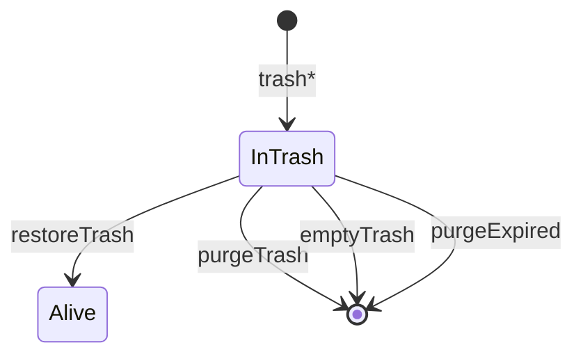

# 回收站批次

一次删除操作生成的 UUID（`delete_batch`），把任务、节点、附件绑成可一起恢复或清除的一组。

## 什么是回收站批次？

`crypto.randomUUID()` 在 `trashTask` / `trashNode` / `trashAttachment` 中写入相关行的 `deleted_at` 与 `delete_batch`。`listTrash` 按 batch 聚合成一条 UI 记录，`type` 为 `task` | `node` | `attachment`。

保留天数 `TRASH_RETENTION_DAYS`（默认 30）。`expires_at = deleted_at + retention`。`server.js` 启动时 `purgeExpiredTrash()`，此后每小时一次。

**关键特征**:
- 删任务会把该任务下仍存活的节点和附件打进同一 batch
- 恢复时会把该 batch 涉及的父任务/父节点一并解除软删，避免孤儿
- 彻底删除才从磁盘或 R2 移除文件

## 代码位置

| 方面 | 位置 |
|------|------|
| 列 | `tasks/nodes/attachments.deleted_at`、`delete_batch` |
| 领域 | `listTrash`、`restoreTrash`、`purgeTrash`、`emptyTrash`、`purgeExpired` |
| API | `GET /api/trash`、`POST /api/trash/:batch/restore`、`DELETE /api/trash/:batch`、`POST /api/trash/empty` |
| Android | `TrashRepository`、`TrashScreen`（在线） |

## 结构

```javascript
{
  batch: "uuid",
  type: "task",
  title: "发布 1.0",
  parent: "",
  deleted_at: "...",
  expires_at: "...",
  days_left: 12,
  nodes: 3,
  attachments: 2
}
```

## 不变量

1. 看板查询一律 `deleted_at IS NULL`。
2. `restoreTrash` 若 batch 在三张表都不存在则返回 false → 404。
3. `purgeTrash` 收集将删除的 `stored_name` + `storage`，由 `removeStored` 真正删文件。
4. 过期清理按 `deleted_at < now - RETENTION_MS` 找出 batch 再 `purgeTrash`。

## 生命周期



## 关系

| 关联概念 | 关系 | 描述 |
|---------|------|------|
| 任务 / 节点 / 附件 | 分组 | 共享 `delete_batch` |
