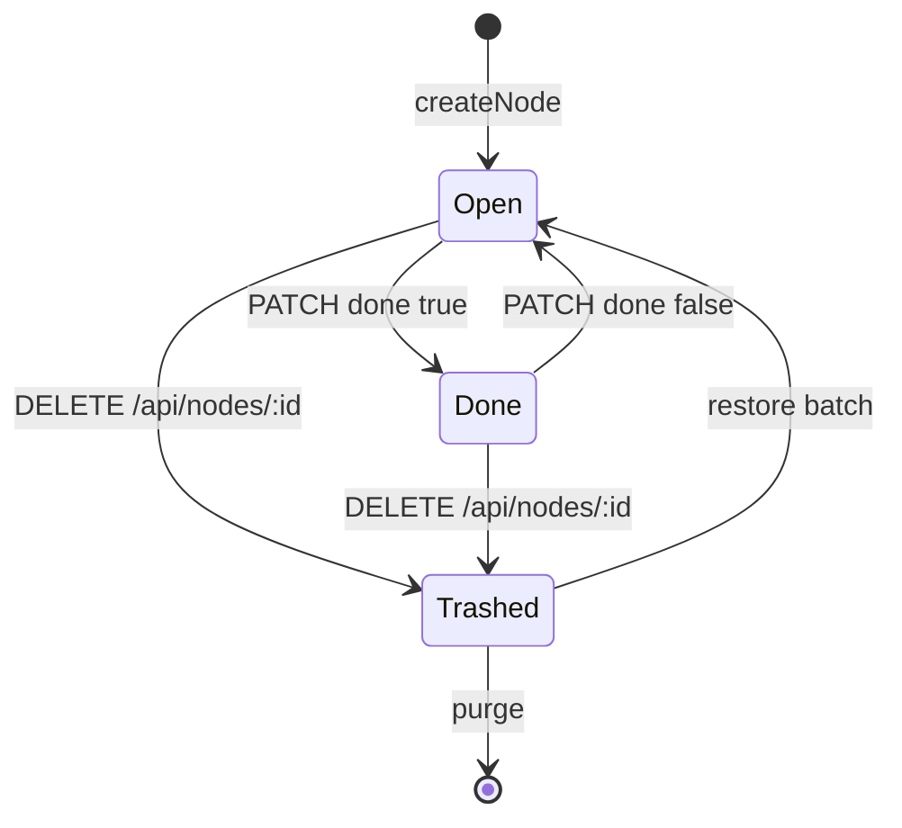

# 节点

任务内部的一条可勾选工作项，带正文与附件。看板卡片上展示节点列表；详情抽屉 / 任务详情页编辑内容。

## 什么是节点？

节点从属于一个任务。完成状态 `done` 只表示勾选，不改变所属任务归档。新建节点使用 `prevOrder`，排到该任务节点列表最前。

**关键特征**:
- 标题 + 长文本 `content`
- 布尔 `done`
- 零到多个附件
- 软删除时附件进入同一批次

## 代码位置

| 方面 | 位置 |
|------|------|
| 表 | `nodes` |
| 领域 | `src/store.js`（`createNode` / `updateNode` / `trashNode` / `reorderNodes`） |
| API | `POST /api/tasks/:id/nodes`、`PATCH/DELETE /api/nodes/:id`、`POST /api/nodes/reorder` |
| Web | 节点抽屉、`#task-detail` |
| Android | `NodeEntity`、`TaskDetailScreen`、离线类型 `CREATE_NODE` / `UPDATE_NODE` / `DELETE_NODE` / `REORDER_NODES` |

## 结构

```javascript
{
  id: 10,
  task_id: 1,
  title: "写发布说明",
  content: "",
  done: false,
  sort_order: 0,
  created_at: "...",
  updated_at: "...",
  attachments: []
}
```

`serializeNode` 把 `done` 转布尔并附带未删除附件。

### 关键字段

| 字段 | 类型 | 描述 | 约束 |
|------|------|------|------|
| `id` | INTEGER | 主键 | |
| `task_id` | INTEGER | 所属任务 | FK `tasks(id)` |
| `title` | TEXT | 名称 | 创建必填 |
| `content` | TEXT | 正文 | 默认空 |
| `done` | INTEGER | 完成 | 接口布尔 |
| `sort_order` | REAL | 顺序 | 新建为当前最小 - 1 |

## 不变量

1. 创建前必须存在未删除任务，否则 API `404 task_not_found`。
2. 更新节点会刷新所属 `tasks.updated_at`。
3. `trashNode` 只软删该节点及其未删附件，不删任务。
4. Android 提交 `CREATE_NODE` 前，父任务必须已有 `remoteId`，否则 `DependencyMissingException` 中断 flush。

## 生命周期



## 关系

| 关联概念 | 关系 | 描述 |
|---------|------|------|
| 任务 | 属于 | `task_id` |
| 附件 | 包含 | `attachments.node_id` |
