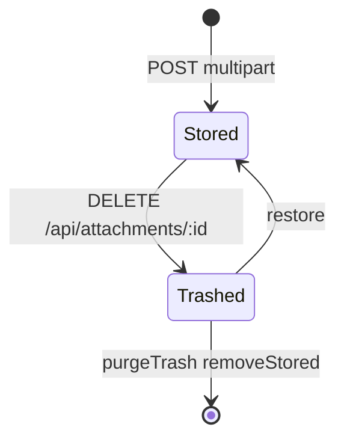

# 附件

挂在节点上的文件。存储位置由 `storage` 字段区分：`local` 落在 `DATA_DIR/uploads/`，`r2` 走 Cloudflare R2。

## 什么是附件？

上传经 multer 落盘（文件名 `uuid + 原扩展名`，扩展名最长 16）。`storage=r2` 时再 `putObject` 并删除临时文件，`stored_name` 改为 R2 object key。

下载统一走 `GET /api/attachments/:id`（需登录）。R2 对象另有 `publicUrl`，Web 预览大文件时可直链。

**关键特征**:
- 保留原始文件名（multer latin1 → UTF-8）
- 可改名（`PATCH original_name`）
- 软删后文件仍在，彻底清除批次时才 `unlink` / `deleteObject`
- 导出 ZIP 只打包本地且磁盘仍在的文件；R2 只写 URL

## 代码位置

| 方面 | 位置 |
|------|------|
| 表 | `attachments` |
| 领域 | `store.addAttachment` / `getAttachment` / `updateAttachment` / `trashAttachment` |
| 对象存储 | `src/storage.js` |
| API | `POST /api/nodes/:id/attachments`、`GET/PATCH/DELETE /api/attachments/:id` |
| Android | `AttachmentEntity`、`AttachmentRepository`（在线上传下载，无离线队列） |

## 结构

对外序列化（不含 `stored_name`）：

```javascript
{
  id: 3,
  node_id: 10,
  original_name: "spec.pdf",
  mime_type: "application/pdf",
  size: 12000,
  storage: "local",
  url: null,
  created_at: "..."
}
```

### 关键字段

| 字段 | 类型 | 描述 | 约束 |
|------|------|------|------|
| `stored_name` | TEXT | 磁盘文件名或 R2 key | 内部字段 |
| `storage` | TEXT | `local` 或 `r2` | 默认 local |
| `url` | string\|null | 仅 R2 公开地址 | 计算字段 |
| `size` | INTEGER | 字节 | |

## 不变量

1. 上传目标 `r2` 时必须 `objectStore.isConfigured()`。
2. 单请求最多 20 个文件。
3. inline 预览仅当 `?inline=1` 且 MIME 匹配 `INLINE_TYPES`。
4. `getAttachment` 不过滤 `deleted_at`（下载仍可能读到已进回收站的行）；改名与软删会检查 `deleted_at`。

## 生命周期



## 关系

| 关联概念 | 关系 | 描述 |
|---------|------|------|
| 节点 | 属于 | `node_id` |
| R2 配置 | 可选后端 | `src/storage.js` `isConfigured()` |
