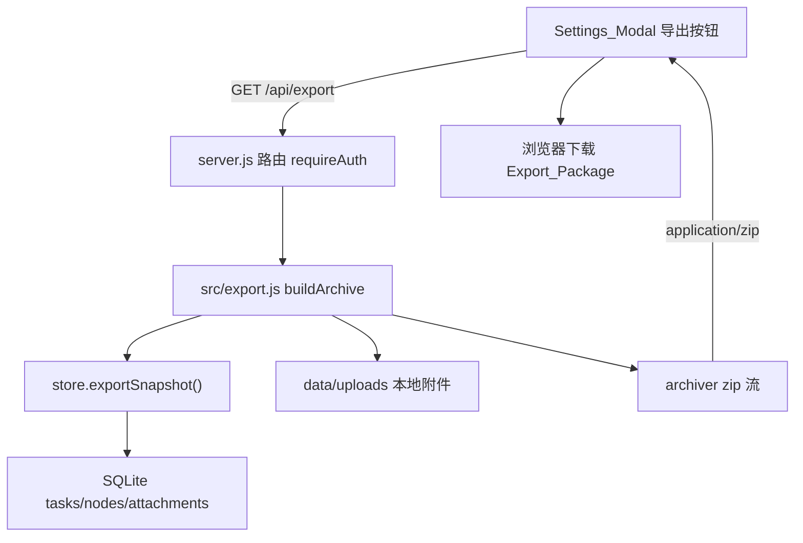

# Export All Content

Feature Name: 2026-10-05-export-all-content
Updated: 2026-10-05

## Description

在设置弹窗中新增「导出全部内容」入口，服务端将全部任务（含已归档）及其节点、内容、附件打包为 ZIP 返回下载。ZIP 结构：

```
manifest.json          # 导出元信息与警告
data.json              # 完整结构化数据（含 schema 版本）
markdown/<task>.md     # 每个任务一个可读文档
attachments/<n>_<name> # 本地附件原始文件
```

R2 附件不打包文件本体，仅在 `data.json` 与 Markdown 中记录公开 URL。

## Architecture



请求经由现有的 `express.static` 之前的 `/api` 路由处理；`requireAuth` 复用现有会话校验中间件（[server.js](../../../server.js) 第 97-145 行附近的登录体系）。

## Components and Interfaces

### 服务端路由

- `GET /api/export`，`requireAuth`
  - 调用 `store.exportSnapshot()` 获取全部未删除任务（含 archived）与节点、附件。
  - 若任务数为 0，返回 `400 { error: 'empty', message: '没有可导出的内容' }`。
  - 设置响应头 `Content-Type: application/zip`、`Content-Disposition: attachment; filename="task-board-export-<stamp>.zip"`。
  - 调用 `export.buildArchive(res, snapshot)` 生成并输出 ZIP；流中途出错时 `res.destroy(err)`。

新增文件 `src/export.js`，导出：

- `buildArchive(writable, snapshot)` — 组装并 `finalize` ZIP 流，返回 `Promise`。
- `buildData(snapshot, fileMap)` — 生成 `data.json` 对象。
- `taskToMarkdown(task, fileMap)` — 生成单个任务的 Markdown 字符串。
- `sanitizeSegment(name)` — 文件名安全化（供内部与测试使用）。

### 存储层

在 `src/store.js` 新增 `exportSnapshot()`：返回任务数组，附件条目附带 `stored_name` 与 `storage`，以便导出模块定位本地文件。该函数不修改现有 `listTasks()` 行为。

### 前端

- `public/index.html`：在 `#settings-modal` 的 `.settings-body` 内新增一个 `settings-section`，包含标题、说明、状态文本与 `#export-btn`。
- `public/app.js`：新增 `el.exportBtn`、`el.exportMessage` 引用与 `exportAllContent()`；通过 `fetch('/api/export', { credentials: 'same-origin' })` 获取 blob，解析 `Content-Disposition` 得到文件名，`URL.createObjectURL` 触发下载。
- `public/styles.css`：复用现有 `settings-section` / `settings-message` / `btn` 样式，无新增样式或仅极小补充。

## Data Models

`data.json`：

```json
{
  "app": "task-board",
  "schemaVersion": 1,
  "exportedAt": "2026-10-05T00:00:00.000Z",
  "counts": { "tasks": 1, "nodes": 2, "attachments": 1 },
  "tasks": [
    {
      "id": 1,
      "title": "示例任务",
      "description": "",
      "color": "blue",
      "archived": false,
      "sort_order": 1,
      "created_at": "...",
      "updated_at": "...",
      "nodes": [
        {
          "id": 10,
          "title": "节点一",
          "content": "内容文本",
          "done": false,
          "sort_order": 1,
          "created_at": "...",
          "updated_at": "...",
          "attachments": [
            {
              "id": 100,
              "original_name": "截图.png",
              "mime_type": "image/png",
              "size": 1234,
              "storage": "local",
              "file": "attachments/0100_截图.png",
              "url": null,
              "created_at": "..."
            }
          ]
        }
      ]
    }
  ]
}
```

`manifest.json`：

```json
{
  "app": "task-board",
  "schemaVersion": 1,
  "exportedAt": "...",
  "counts": { "tasks": 1, "nodes": 2, "attachments": 1, "files": 1 },
  "warnings": ["附件文件缺失：attachments/0101_old.pdf"]
}
```

附件相对路径命名规则：`attachments/<附件id零填充4位>_<sanitize(original_name)>`，利用附件 id 天然保证唯一，避免跨节点重名。

## Correctness Properties

- 每个 `deleted_at` 为空的任务在 `data.json.tasks` 中恰好出现一次。
- 每个导出任务生成的 Markdown 文件数量等于 `tasks.length`。
- `data.json` 可被 `JSON.parse` 解析且包含正整数 `schemaVersion`。
- `manifest.counts.files` 等于实际写入 `attachments/` 的文件数。
- 任一 Local_Attachment 若文件存在，则其 `file` 路径在 ZIP 中可被找到。

## Error Handling

- 无任务：路由返回 400 JSON，前端显示「没有可导出的内容」。
- 本地附件文件缺失：跳过并在 `manifest.warnings` 记录，导出继续。
- R2 附件无公开 URL：`url` 记为 `null`，导出继续。
- 打包/流错误：若响应头未发送，由 Express 错误中间件返回 JSON；若已发送，`res.destroy` 终止连接，前端提示导出失败。
- 未登录：`requireAuth` 返回 401，前端提示重新登录。

## Test Strategy

- 使用 Node 内置测试运行器 `node --test` 新增 `test/export.test.js`，覆盖纯函数：
  - `sanitizeSegment` 移除 `/ \ : * ? " < > |` 与控制字符，且不产生空名。
  - `taskToMarkdown` 包含标题、节点内容、附件相对路径与 R2 URL。
  - `buildData` 输出 `schemaVersion`、`counts` 与附件 `file` 字段。
- 集成验证（手动）：
  - 构造含有本地附件与空任务的数据，调用 `GET /api/export`，用 `unzip -l` 校验条目，`unzip -p ... data.json | node -e` 校验可解析。
  - 校验未登录返回 401，无任务返回 400。
- 运行 `node --check` 校验服务端与前端脚本语法。

## Dependencies

- 新增运行时依赖 `archiver`（生成 ZIP 流）。Node 22 无内置 zip 能力，`archiver` 支持流式追加文件与字符串，满足大附件不落盘的需求。

## References

[^1]: [server.js](../../../server.js) — 现有路由、`requireAuth` 与静态资源服务。
[^2]: [src/store.js](../../../src/store.js) — `listTasks` 与序列化函数，导出快照的依据。
[^3]: [src/db.js](../../../src/db.js) — `DATA_DIR` / `UPLOAD_DIR` / `DB_FILE` 位置。
[^4]: [src/storage.js](../../../src/storage.js) — R2 附件公开 URL 生成。
[^5]: [public/index.html](../../../public/index.html) — `#settings-modal` 结构与新增入口位置。
[^6]: [public/app.js](../../../public/app.js) — 设置弹窗交互与新增导出逻辑。
