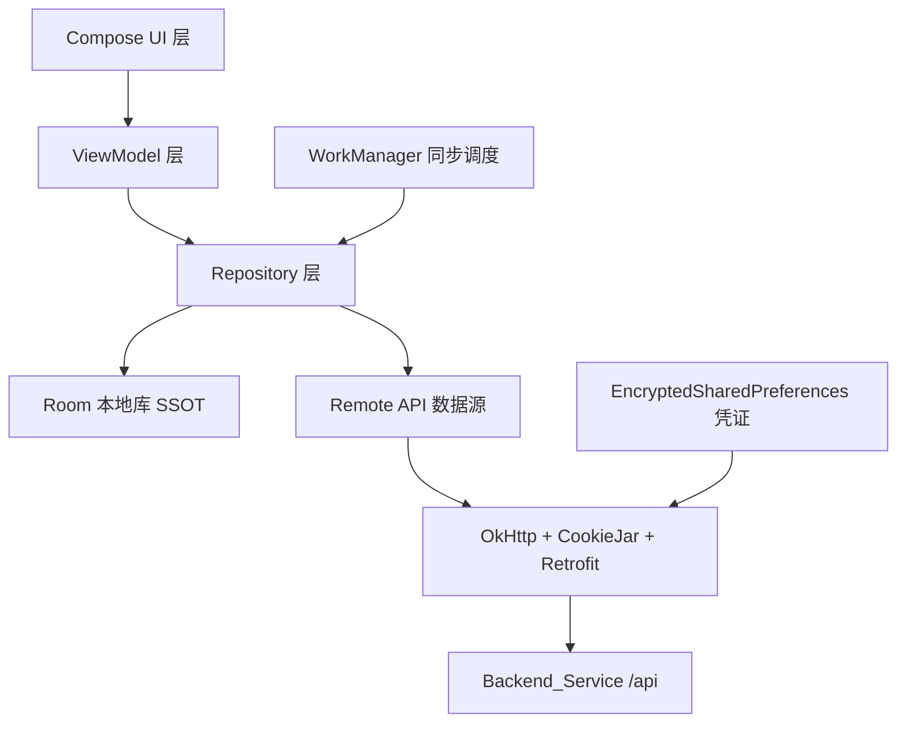
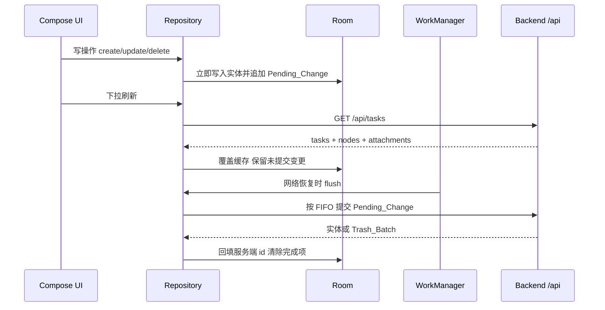
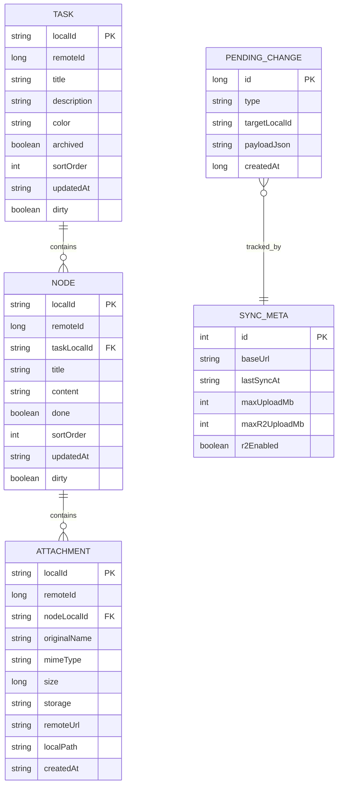

# Android 同步客户端

Feature Name: android-sync-client
Updated: 2026-10-06

## Description

为现有任务面板（Express + SQLite 后端，`server.js`）增加原生 Android（Kotlin）客户端。客户端连接用户已有的公网域名，以 Room 作为单一数据源（SSOT）完成任务的在线/离线增删改、附件下载与上传、回收站管理、内容导出，以及设置与账号维护。后端接口无需修改，客户端复用现有 Cookie 会话鉴权。

本环境不具备 Android SDK 与真机连接能力，交付物为可导入 Android Studio 的完整 Kotlin 工程源码与测试，APK 由用户本地或 CI 编译。

## Architecture

### 分层

### 同步数据流

### 技术选型

| 关注点 | 方案 |
|--------|------|
| 语言 / 构建 | Kotlin，Gradle Kotlin DSL |
| 最低 / 目标 SDK | minSdk 26（Android 8.0），targetSdk 按当前稳定版 |
| UI | Jetpack Compose + Material 3 + Navigation Compose |
| 网络 | Retrofit + OkHttp + kotlinx.serialization |
| 本地存储 | Room |
| 异步 | Kotlin Coroutines + Flow（Flow 作为 SSOT 输出） |
| 后台同步 | WorkManager（带网络约束 + 退避重试） |
| 依赖注入 | 手写依赖容器（`AppContainer`，避免注解处理器版本耦合） |
| 安全存储 | androidx.security EncryptedSharedPreferences |

## Components and Interfaces

### 网络层

- `AuthInterceptor`：为 `/api` 请求附加 `Authorization: Bearer <token>`；收到 401 时由 `safeApiCall` 映射为 `ApiErrorKind.UNAUTHORIZED`。
- `TokenStore`：使用 EncryptedSharedPreferences 保存服务地址与令牌，加密存储初始化失败时回退到应用私有普通存储。
- `ApiHolder`：按 baseUrl 懒创建并缓存 Retrofit 实例（用户可在登录页更换服务地址）。
- `TaskBoardApi`：Retrofit 接口，声明下列端点。

| 方法 | 路径 | 请求体 / 参数 | 响应 |
|------|------|--------------|------|
| GET | `/api/session` | - | `authEnabled, authed, maxUploadMb, maxR2UploadMb, retentionDays, r2Enabled, deployedDir` |
| POST | `/api/login` | `{username, password}` | `{ok, token, expiresInMs}` |
| POST | `/api/logout` | - | `{ok}` |
| GET | `/api/account` | - | `{username}` |
| PUT | `/api/account` | `{username, currentPassword, newPassword}` | `{ok, username, token}`（改密后旧令牌失效，返回新令牌） |
| GET | `/api/system` | - | `{version, branch, git, remote, update}` |
| GET | `/api/sync` | - | `{serverTime, tasks[], trash[], retentionDays, maxUploadMb, maxR2UploadMb, r2Enabled}` |
| GET | `/api/tasks` | - | `{tasks:[{...task, nodes:[{...node, attachments:[...]}]}]}` |
| POST | `/api/tasks` | `{title, description, color}` | `{task}` |
| PATCH | `/api/tasks/:id` | 字段子集 | `{task}` |
| DELETE | `/api/tasks/:id` | - | `{ok, batch}` |
| POST | `/api/tasks/reorder` | `{ids:[...]}` | `{ok}` |
| POST | `/api/tasks/:id/nodes` | `{title, content}` | `{node}` |
| PATCH | `/api/nodes/:id` | 字段子集 | `{node}` |
| DELETE | `/api/nodes/:id` | - | `{ok, batch}` |
| POST | `/api/nodes/reorder` | `{ids:[...]}` | `{ok}` |
| POST | `/api/nodes/:id/attachments` | multipart `files`，query `storage` | `{attachments, storage}` |
| GET | `/api/attachments/:id` | query `inline` | 文件流 |
| PATCH | `/api/attachments/:id` | `{original_name}` | `{attachment}` |
| DELETE | `/api/attachments/:id` | - | `{ok, batch}` |
| GET | `/api/trash` | - | `{items, retentionDays}` |
| POST | `/api/trash/empty` | - | `{ok}` |
| POST | `/api/trash/:batch/restore` | - | `{ok}` |
| DELETE | `/api/trash/:batch` | - | `{ok}` |
| GET | `/api/export` | - | zip 流 |

### 仓储层

- `TaskRepository`：暴露 `Flow<List<TaskWithNodes>>`（来自 Room）。所有写操作先落 Room、追加 `PendingChangeEntity`，再尝试 `PendingChangeSyncer` 提交。
- `AttachmentRepository`：下载通过 `GET /api/attachments/:id`，上传通过 multipart。上传前用 `GET /api/session` 的 `maxUploadMb` / `maxR2UploadMb` 做本地大小校验；`r2Enabled=false` 时隐藏 R2 选项。
- `TrashRepository`：`GET /api/trash` 在线拉取，恢复/彻底删除/清空均为在线操作（离线时不可用）。
- `ExportRepository`：流式保存 `GET /api/export` 到应用私有目录后，经 FileProvider 分享或写入用户选择的目录（SAF）。
- `SessionRepository`：登录、登出、会话校验、`PUT /api/account`。
- `PendingChangeSyncer`：按 `id` 升序（FIFO）逐条提交，成功后删除记录并回填服务端 id。

### 本地 id 与依赖解析

离线创建的任务/节点使用客户端生成的 `localId`（UUID 字符串）作为 Room 主键与线上实体引用键。变更队列的 payload 只保存 `localId`，提交时再查库解析成服务端自增 `id`，因此无需在创建成功后回写子实体引用；FIFO 顺序保证父任务创建先于其子节点创建。服务端 `id` 以可空的 `remoteId` 字段保存。

### 后台同步

`SyncWorker`（WorkManager，唯一任务名 + `NetworkType.CONNECTED` 约束）负责：先 flush `PendingChangeEntity`，再执行一次全量拉取。`SyncScheduler` 在登录成功、应用回到前台、网络恢复时入队。

## Data Models

### 服务端对象（响应字段，`src/store.js`）

- Task：`id, title, description, color, archived, sort_order, created_at, updated_at, nodes[]`
- Node：`id, task_id, title, content, done, sort_order, created_at, updated_at, attachments[]`
- Attachment：`id, node_id, original_name, mime_type, size, storage(local|r2), url, created_at`
- TrashItem：`batch, type, title, parent, deleted_at, expires_at, days_left, nodes, attachments`

### Room 实体

### PendingChange.type 枚举

`CREATE_TASK, UPDATE_TASK, DELETE_TASK, REORDER_TASKS, CREATE_NODE, UPDATE_NODE, DELETE_NODE, REORDER_NODES, UPLOAD_ATTACHMENT, RENAME_ATTACHMENT, DELETE_ATTACHMENT, RESTORE_TRASH, PURGE_TRASH, EMPTY_TRASH`

离线可编辑范围仅任务与节点；附件上传/回收站/导出为在线操作（见需求 4、5、6）。

## Correctness Properties

1. Room 是 UI 的唯一数据源；任何网络响应先写库再由 Flow 驱动界面刷新。
2. `PendingChangeEntity` 在进程重启后仍存在（Room 持久化），保证离线变更不丢失。
3. 同一实体的变更按 `id` 升序提交；`CREATE` 必先于其引用的子实体的 `CREATE`。
4. 临时 id 到服务端 id 的回填必须原子完成，且同步重写队列中的引用，避免产生孤儿节点。
5. 会话令牌只发送给 Base_URL；退出登录后令牌与本地缓存被清除。
6. 服务端 `updated_at` 晚于本地记录时，服务端版本覆盖本地（需求 7.6）。
7. 全量拉取不得删除本地尚存在 Pending_Change 的实体。
8. `r2Enabled=false` 时上传存储目标恒为 `local`。

## Error Handling

| 场景 | 处理 |
|------|------|
| 网络不可用 | 写操作入队；读操作回退 Local_Cache；展示离线标识 |
| 任意接口 401 | 视为会话失效：清 Cookie、跳登录、保留 Pending_Change |
| 登录 429 | 展示“尝试次数过多，请稍后再试” |
| 写操作 404 | 从 Local_Cache 移除该实体并提示已不存在，丢弃对应队列项 |
| 上传超限 | 依 `maxUploadMb` / `maxR2UploadMb` 本地拦截 |
| `GET /api/export` 400 | 提示“没有可导出的内容” |
| 后端未配置 R2 | 上传仅提供 local |
| 服务器重启导致会话失效 | 401 触发重新登录流程，不丢失本地队列 |
| 流式下载中断 | 删除半成品文件并允许重试 |

## Test Strategy

后端（已交付，`npm test` 通过）：

- `test/auth.test.js`：令牌提取（Cookie 优先、Bearer 大小写不敏感、缺失回退）、签发/校验回环、篡改拒绝、改密使旧令牌失效。

Android（已交付，需在具备 Android SDK 的环境执行）：

- `ApiHolderTest`：baseUrl 规范化。
- `FileUtilTest`：文件名清洗、体积格式化、明文判定。
- `ApiContractTest`（MockWebServer）：登录解析 `token`、拦截器附加 `Authorization: Bearer`、`safeApiCall` 将 401 映射为 `UNAUTHORIZED`、网络失败映射为 `NETWORK`。

后续可补充（未交付）：Room in-memory 的合并策略测试、`PendingChangeSyncer` 的 FIFO 与 404 丢弃分支。

说明：Android 测试在本环境安装 JDK 17 + Android SDK 34 + Gradle 8.7 后实际执行，`ApiHolderTest`、`FileUtilTest`、`ApiContractTest` 共 9 项全部通过，并成功产出 `app-debug.apk`。

## Backend Changes

为支持移动端，后端在保持 Web 前端行为不变的前提下做了两处改动（`server.js`）：

1. 会话令牌双通道：`isAuthed` 通过 `auth.extractToken` 同时接受 `tb_session` Cookie 与 `Authorization: Bearer <token>`；`POST /api/login` 与 `PUT /api/account` 在响应体返回 `token`。
2. 新增 `GET /api/sync` 聚合快照接口，一次返回任务树、回收站与上传限制。

## Build and Deliverables

- 目标工程结构：`android/`（Gradle Kotlin DSL，多模块或单模块 `app`）。
- 关键配置：OkHttp `CookieJar`、Room schema 导出、WorkManager 初始化、FileProvider 声明、`INTERNET` 权限、`POST_NOTIFICATIONS` 权限。
- 交付：可导入 Android Studio 的源码与测试；Base_URL 由用户在首次启动时填写。

## References

[^1]: (server.js#L99-L146) - 会话、登录登出与账号接口定义
[^2]: (server.js#L216-L400) - 任务、节点、附件、回收站接口定义
[^3]: (server.js#L404-L429) - 导出 zip 接口
[^4]: (src/store.js) - 任务、节点、附件与回收站数据模型及字段
[^5]: (src/auth.js#L9-L11) - 会话 Cookie 名与有效期
[^6]: (src/auth.js#L51-L106) - 会话签名与校验实现
[^7]: (server.js#L49-L59) - 上传存储目标选择与大小限制
